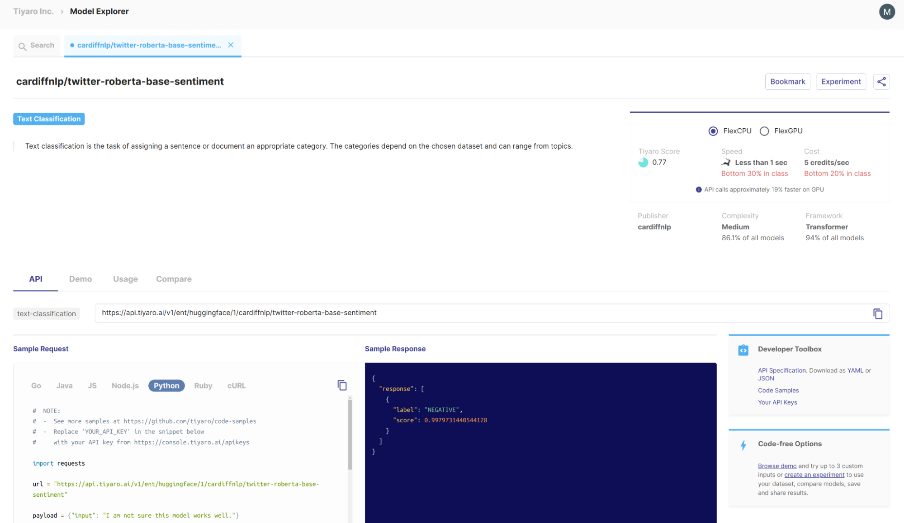
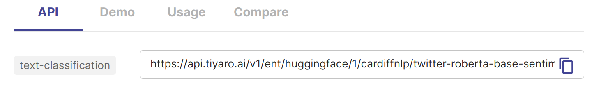

QuickStart
==========

.. _quickstart:

All you need to use a Model from Tiyaro is

#. :ref:`findapi`
#. :ref:`genapikey` 
#. :ref:`findsig` 
#. :ref:`callapi` 

.. _findapi:

Find the API endpoint URL for the model from the UI
---------------------------------------------------
| e.g. See below the model card for model 'cardiffnlp/twitter-roberta-base-sentiment'

| 
| e.g. See below the API endpoint URL for 'cardiffnlp/twitter-roberta-base-sentiment' 

The URL in this case is https://api.tiyaro.ai/v1/ent/huggingface/1/cardiffnlp/twitter-roberta-base-sentiment

.. _genapikey:

Generate your API Key for use the API
-------------------------------------

Go to `API Keys <https://console.tiyaro.ai/apikeys>`_ page to generate your API key.

.. _findsig:

Find the input and output parameters of the API from its model type
-------------------------------------------------------------------

Each Model API in tiyaro has a 'model type'. You can find out the 'model type' of the model from the model card. 

As seen above the 'model type' is right next to the API url. So the 'model type' of ‘cardiffnlp/twitter-roberta-base-sentiment’ is ‘text-classification’.

Once you have the 'model type', look at the API reference in this doc for this 'model type' to find out its input and output parameters. In this example the API signature for ‘cardiffnlp/twitter-roberta-base-sentiment’ which is of model type ‘text-classification’ is <here>.

.. _callapi:

Call the API from your application
----------------------------------

The model Card has a ‘snippet’ for many languages that you can ‘adapt’ for use in your app. If you want fully functioning stand alone programs you can look at the `Tiyaro code samples repo <https://github.com/tiyaro/code-samples>`_.

.. note:: Most APIs usually support multiple different types of input. For instance, computer vision models can take both an URL or a local image as a base64 encoded string.  Please refer to the API reference section to find out all the various input formats that are supported by a given API. Refer to the `code samples repo <https://github.com/tiyaro/code-samples>`_ to find helper routines to convert your local image or audio files into base64 format.