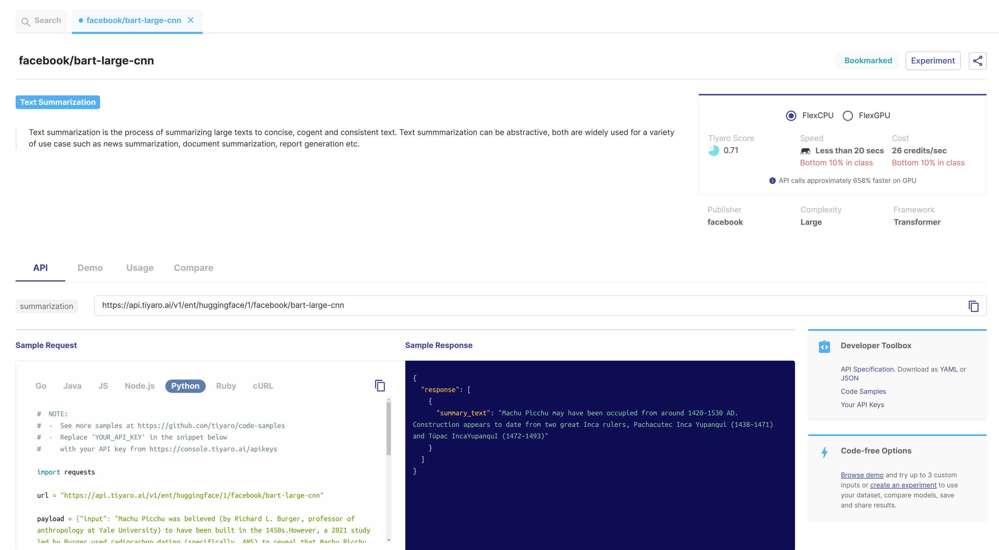
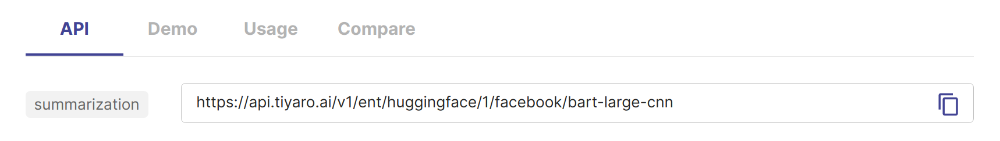

Model Card
==========

.. _samplemodel:

`Tiyaro Model Explorer <https://console.tiyaro.ai/explore>`_ allows you to search for models. Clicking on the results of the search will open the **model card** for that model.

Here is a screenshot of the model card for model facebook/bart-large-cnn

Every model available on Tiyaro is readily accessible as an API endpoint. The model card includes the 

* API endpoint URL
* :ref:`modeltype` of the model

.. _modeltypeoncard:

For the facebook/bart-large-cnn model the API endpoint URL and the model type can be found on the model card as shown below.

As seen above the endpoint and type for this model are 

.. csv-table:: 
   :header: "Model Type", "API endpoint"

   "summarization", "https://api.tiyaro.ai/v1/ent/huggingface/1/facebook/bart-large-cnn"
