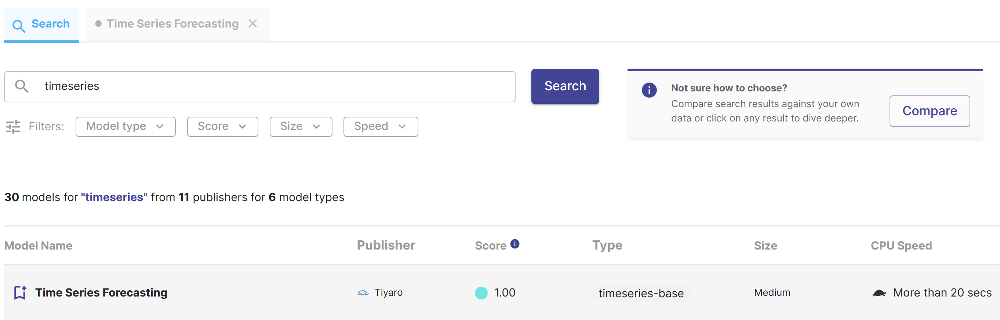
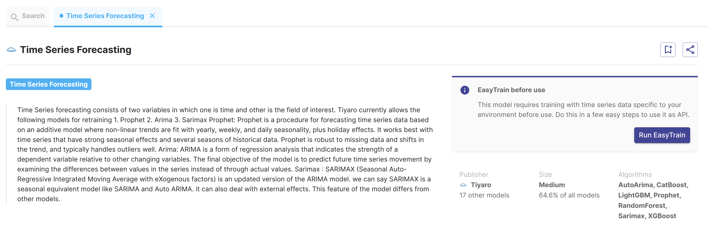
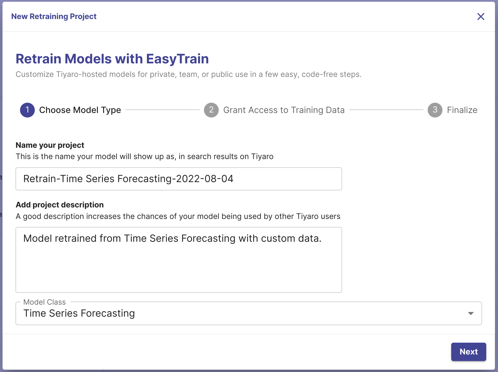
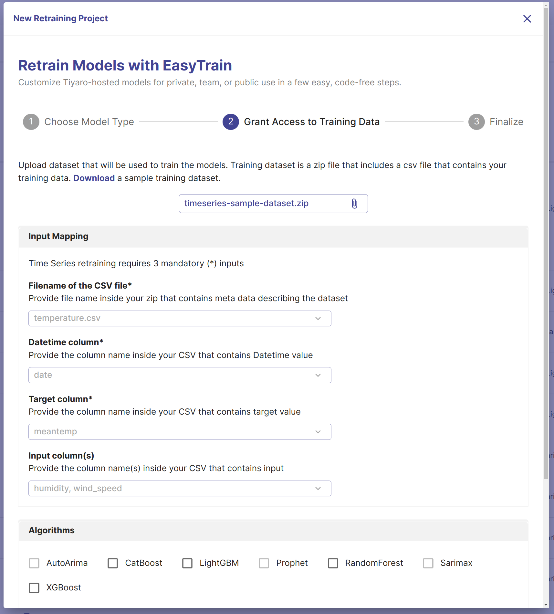
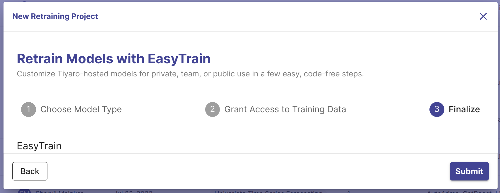
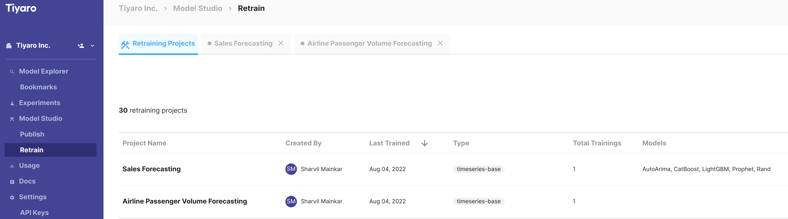
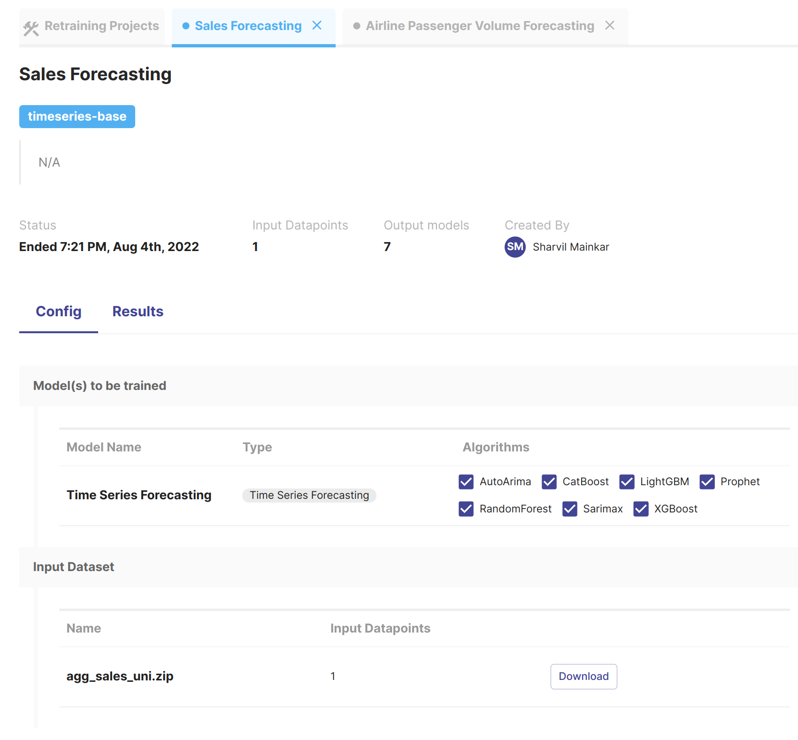
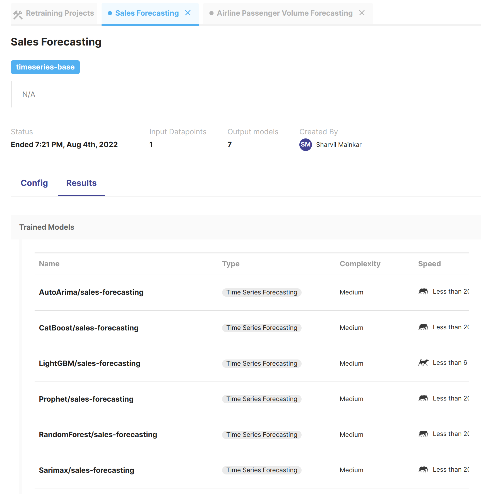
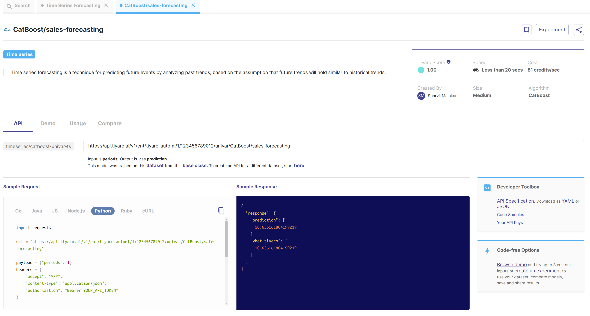

Timeseries Forecasting
======================

Timeseries forecasting has multiple applications like predicting inventory, trends in stock prices, 
housing trends, weather and sales predictions to name a few. Users have a variety of timeseries predictive 
models to choose from. Which type of model works best depends on the type of task and data that you are using. 
Tiyaro is making a large number of timeseries models available that you can easily and quickly train, compare 
and choose the model that works best for you without having to write a single line of code. There are 2 types of predictive models that are currently supported. 

* Univariate Forecasting
* Univariate Forecasting with exogeneous variables

.. _univariate_ts:

Univaraite Forecasting
----------------------
The following univariate models are available on Tiyaro

* Prophet
* AutoARIMA
* LightGBM
* RandomForest
* XGBoost
* SARIMAX
* CatBoost

.. _univariate_exo_ts:

Univariate Forecasting with exogeneous variables
-------------------------------------------------
The following univariate models with exogeneous variables are available on Tiyaro

* LightGBM
* RandomForest
* XGBoost
* CatBoost

.. note::  Timeseries Forecasting models are different from the other AI/ML models being served by Tiyaro. Forecasting is very specific to a user and their historical data. Hence the typical workflow for using a Timeseries model involves **retraining** the various models for your dataset and then using the **retrained** models for inference. The details of these steps are covered below.

In order for you to *customize* or *retrain* the models all you need is the historical data that will be used 
to train the models. The entire process of training is simplified by the Tiyaro **EasyTrain** system. We built
the EasyTrain system so that users can train all the algorithms in a single step without writing a single line of code. 
EasyTrain also uses intelligent defaults for the various hyperparameters requried by the models so the burden of 
training the models is shifted from the user to the EasyTrain system.

How to train your custom timeseries predictive models
-----------------------------------------------------
1. Find the **Timeseries** base model.
2. Retrain or Customize the base model with your training data

--------------------------------
Find the *Timeseries* base model
--------------------------------
Simply search for 'timeseries' or the name of any of the models from above .e.g. prophet, autorarima in the Model Explorer.

Select the **Time Series Forecasting** model. It has type of **timeseries-base** class. This is the base class form
which you can train your custom models. Selecting this model will open the model card as shown below.

Note the **Run EasyTrain** button on the model card

--------------------------------------------------------
Retrain/Customize the base model with your training data
--------------------------------------------------------
Click on the **Run EasyTrain** button to start the retraining. It will walk you through the steps of retraining the timeseries model. 

First step, name your retraining project.

Second step, provide your training data.

Format of the expected training dataset
+++++++++++++++++++++++++++++++++++++++

The training data needs to be packaged as a zip file. Here is a `sample dataset <https://public-model-demo.s3.us-west-2.amazonaws.com/timeseries-sample-dataset.zip>`_ 
that you can download to inspect its format and structure. Lets look at the structure of this sample dataset to understand the expected format.

.. code-block:: bash

    $ wget -q https://public-model-demo.s3.us-west-2.amazonaws.com/timeseries-sample-dataset.zip 
     
    $ ls
    timeseries-sample-dataset.zip
     
    $ unzip timeseries-sample-dataset.zip 
    Archive:  timeseries-sample-dataset.zip
      inflating: temperature.csv         
     
    $ ls
    temperature.csv  timeseries-sample-dataset.zip
     
    $ head temperature.csv 
    date,meantemp,humidity,wind_speed,meanpressure
    2013-01-01,10.0,84.5,0.0,1015.6666666666666
    2013-01-02,7.4,92.0,2.98,1017.8
    2013-01-03,7.166666666666667,87.0,4.633333333333334,1018.6666666666666
    2013-01-04,8.666666666666666,71.33333333333333,1.2333333333333334,1017.1666666666666
    2013-01-05,6.0,86.83333333333333,3.6999999999999997,1016.5
    2013-01-06,7.0,82.8,1.48,1018.0
    2013-01-07,7.0,78.6,6.3,1020.0
    2013-01-08,8.857142857142858,63.714285714285715,7.142857142857143,1018.7142857142857
    2013-01-09,14.0,51.25,12.5,1017.0
     
 
As you can see above, the zip file *timeseries-sample-dataset.zip* contains a single csv file called *temperature.csv*. The csv 
file has many columns. Where

* date - is the datetime column
* meantemp - is the target column i.e. the value that is going to be predicted
* wind, speed, meanpressure - are the exogeneous input columns. Note these are **optional** columns

Last step, Finish.

Once you click **Submit** the retraining job is kicked off. It typically takes 10-40 minutes to retrain a model depending on the size of your training datasaet and the number of algorithms/models that you are training.

Retraining jobs
+++++++++++++++

All your retraining jobs are listed under the **Retrain** menu item in the UI as shown below. 

Clicking on one of the jobs will open up the **retraining** card. On the retraining card the *Config* subtab shows 
the details of inputs used to train the job as shown below.

The *Results* tab shows the **custom trained models** as shown below 

Clicking on them will open the :ref:`Model card <modeltypeoncard>` for those models as shown below. Like every model card it has all the information including the API endpoint, swagger spec for you to use that model.

In case you are wondering what about Univariate vs Univaraite with exogeneous inputs. The EasyTrain system takes care of it for your automatically, as explained in the note below.

.. note::  If you provide the optional 'Input Columns' in the training input then the EasyTrain system will train :ref:`Univariate with exogenous input <univariate_exo_ts>` models else it trains the :ref:`Univariate <univariate_ts>` models

Summary
-------

We saw the process of retraining your custom timeseries forecasting models to find the retrained models in the *Retrainn* tab to going to the model card of the retrained models where you find
all the information to use those retrained models in your application. You can also search for your models in the Model Explorer.